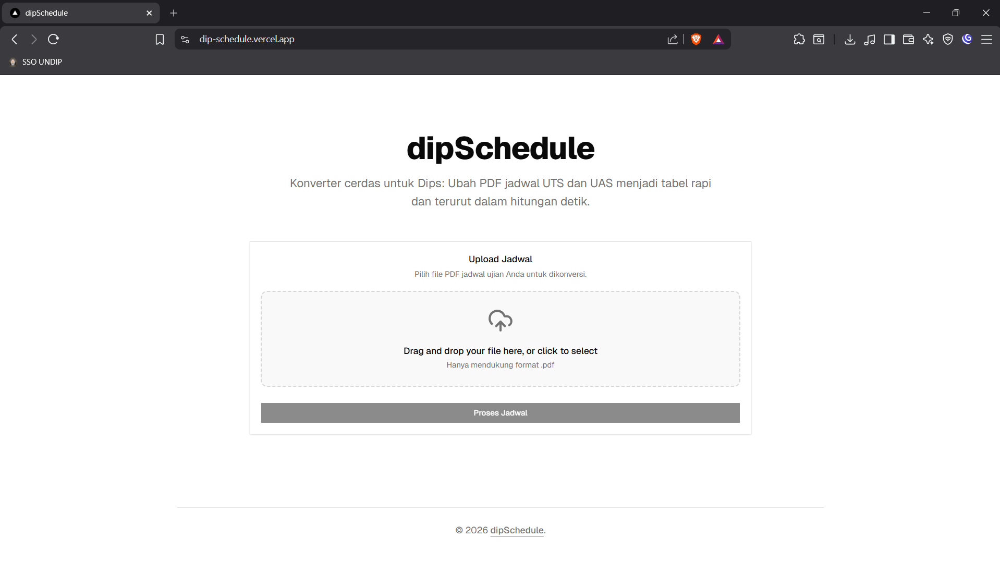

# dipSchedule

> **Konverter cerdas untuk mahasiswa/i Undip:** Ubah PDF jadwal UTS dan UAS menjadi tabel rapi dan terurut dalam hitungan detik.



Pernah gak sih teman-teman kebingungan hari pertama UTS/UAS itu matkul apa dikarenakan tabel jadwal UTS/UAS hasil unduhan dari SIAP Akademik tidak berurutan? Baca manual bingung, konversi ke file excel kemudian disortir butuh waktu lama... tenang, **dipSchedule** hadir untuk membantu teman-teman membaca tabel jadwal UTS/UAS dengan jauh lebih mudah!

**dipSchedule** adalah aplikasi web berbasis AI yang mempermudah mahasiswa dalam membaca, merapikan, dan mengekspor jadwal ujian mereka dari file PDF (hasil unduhan sistem akademik Undip/SIAP Undip) menjadi format tabel, CSV, atau Excel (XLSX) yang mudah dibaca.

## Fitur Utama

- **Smart Extraction**: Menggunakan AI Google Gemini (2.5 Flash) untuk mendeteksi, mengekstraksi, dan merapikan data jadwal secara otomatis.
- **Auto-Sorting**: Jadwal otomatis diurutkan dari waktu terdekat berdasarkan *timestamp*.
- **Export ke CSV & Excel**: Unduh hasil ekstraksi langsung ke format `.csv` atau `.xlsx` dengan satu klik.
- **Performa Tinggi**: Tidak menggunakan library SDK AI/PDF yang berat, file langsung diolah ke dalam format Base64 dan diproses melalui _Native Fetch API_.
- **UI Modern**: Antarmuka _drag-and-drop_ yang menarik didukung oleh Tailwind CSS dan Shadcn UI.

## Tech Stack

- **Framework**: [Next.js](https://nextjs.org/) (App Router)
- **Language**: [TypeScript](https://www.typescriptlang.org/)
- **AI Model**: Google Gemini (via Native REST API)
- **Styling**: [Tailwind CSS](https://tailwindcss.com/) & [Radix UI / Shadcn UI](https://ui.shadcn.com/)
- **Data Export**: [PapaParse](https://www.papaparse.com/) (CSV) & [SheetJS (xlsx)](https://sheetjs.com/) (Excel)

## Persyaratan (Prerequisites)

- Node.js (Versi 18 atau terbaru)
- API Key Google Gemini (Dapatkan gratis di [Google AI Studio](https://aistudio.google.com/))

## Instalasi dan Menjalankan Proyek

1. **Clone repositori ini** (atau _download_ proyeknya):
   ```bash
   git clone https://github.com/ReintB/dipSchedule.git
   cd dipschedule
   ```

2. **Instal dependensi**:
   ```bash
   npm install
   ```

3. **Konfigurasi Environment Variable (*.env.local*)**:
   Buat file bernama `.env.local` di *root/folder* utama proyek Anda dan masukkan API Key Gemini yang Anda miliki:
   ```env
   GEMINI_API_KEY=masukkan_api_key_disini
   ```

4. **Jalankan Development Server**:
   ```bash
   npm run dev
   ```
   Buka [http://localhost:3000](http://localhost:3000) di browser untuk melihat hasilnya.

## Tata Cara Penggunaan

### 1. Cara Mengunduh Kartu Ujian (SSO Undip)
Sebelum menggunakan aplikasi, pastikan Anda telah memiliki file jadwal ujian (PDF).
1. Buka laman [Login SSO Undip](https://sso.undip.ac.id/auth/user/login).
2. Masukkan kredensial Anda (NIM/NIP/Username/Email resmi Undip) lalu klik **Login**.
3. Masukkan password akun SSO Anda.
4. Pada dashboard utama, pilih menu **Akademik & Penelitian**.
5. Pilih submenu/halaman **SIAP**, lalu klik bagian **Akademik**.
6. Pada halaman `IRS-Index`, navigasikan ke *tab* **IRS**.
7. Pilih semester aktif yang sedang Anda jalani.
8. Klik tombol **Cetak Kartu UTS** atau **Cetak Kartu UAS** untuk menyimpan berkas PDF ujian ke perangkat Anda.

### 2. Cara Mengkonversi Jadwal (di dipSchedule)
1. Buka situs web resmi kami di: **[https://dip-schedule.vercel.app/](https://dip-schedule.vercel.app/)**
2. *Drag and drop* atau klik area unggah untuk memasukkan file PDF Kartu UTS/UAS yang baru saja Anda unduh.
3. Klik tombol **"Proses Jadwal"**.
4. Tunggu beberapa detik saja hingga AI selesai bekerja mengekstrak tabel jadwal.
5. Selesai! Jadwal konversi akan langsung ditampilkan dalam bentuk tabel ringkas dan telah diurutkan berdasarkan waktu pelaksanaan secara otomatis.
6. (Opsional) Anda dapat menyimpannya dengan mengklik tombol unduh **CSV** atau **XLSX (Excel)**.

## Lisensi dan Kontribusi

Dibuat oleh [ReintB](https://github.com/ReintB/dipSchedule).  
Kontribusi dan *issue* sangat diterima di Repositori GitHub!  
Jika Anda menyukai proyek ini, jangan lupa berikan ⭐ (Star) di GitHub!